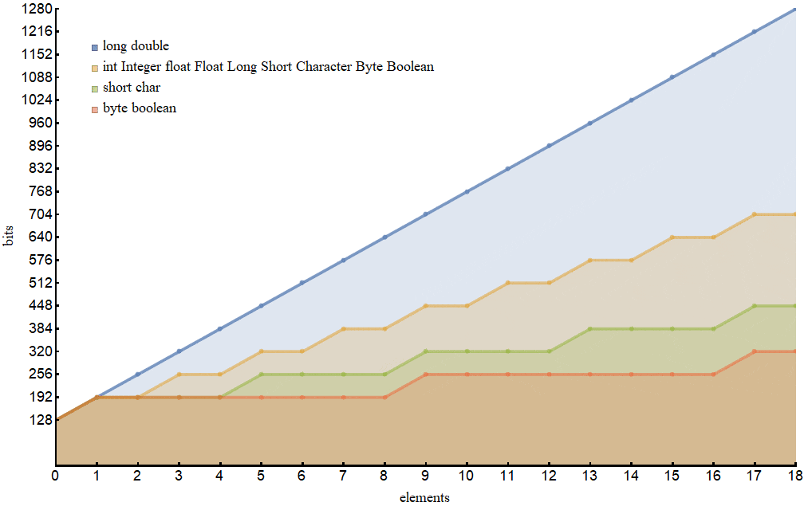
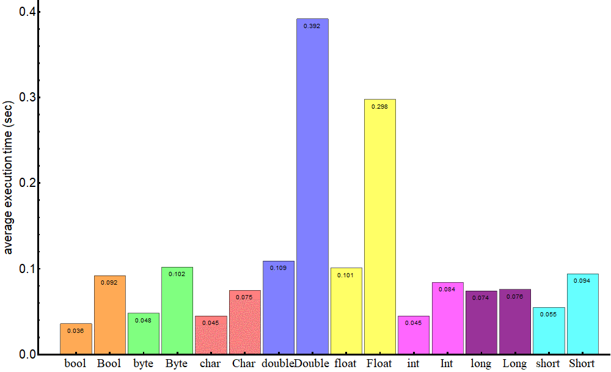

# Maps Primitives File I/O

## Read 03

### Joshua McCluskey

### Java Type System

- Primitives are like int and boolean
- Reference Types are like Integer and Boolean
- Wrapper classes are immutable
- Java will convert between primitive and reference type
- Converting primitive type to reference is called autoboxing and inverse is unboxing

```Java
Integer num = 8; //autoboxing
int num1 = new Integer(8); //unboxing
```

- Performance and memory allocation are important when deciding which to use
- 
Primitives:
- bool 1 bit
- byte 8 bits
- short, char 16 bits
- int, float - 32 bits
- long, double - 64 bits

Reference Types:
- Boolean - 128 bits
- Byte -128 bits
- Short, Character - 128 bits
- Integer, Float - 128 bits
- Long, Double - 192 bits

- Except for long and double primitive types are more expensive than their respective reference type


Image Credit  [Baeldung](https://www.baeldung.com/java-primitives-vs-objects)

- Performance depends on the hardware of the system you are working which is what your compiler uses
- Primitive types live on the stack
- Reference types live on the heap

Performance based on types


Image Credit  [Baeldung](https://www.baeldung.com/java-primitives-vs-objects)


- reference types live on the heap and are slow to access
- Primitives Default values are 0 or false or \u0000
- References default to null

Overall primitives require less memory and are faster

### Exceptions

- An exception is an event that disrupts flow of program
- Create a try catch to deal with exceptions and blacks
- checked exception
- error exception
- runtime exception
- Use throw statement to throw exception
- try-with statement is a try statement concerned with resource
- sepcify exception don't side step to avoid compiler errors
- Advantages you deal with errors and know what the specific exceptions are

### Scanning

- Objects of Scanner convert input into tokens and translate tokens according to data type
- 
[<=== Back](../README.md)
