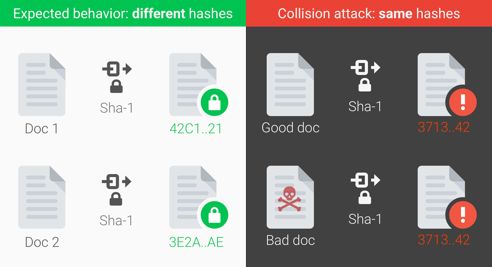

# BCrypt

## Read 14

### Joshua McCluskey

### Hashing Passwords: One-Way Road to Security

- Storing passwords on the server side can be risky and complex
- Use a table in the database that maps usernames and passwords
- When the passwords and username match that in the database, user gains access
- cleartext is data that is stored in the clear
- plaintext is data severing as input for a cryptographic algorithm
- storing passwords in clear text can be compromised
- Hashing is chopping it up into small pieces and making it hard to read
- cryptography uses a hash function that maps data into a bit string of fixed size-- this is input or message
- MDs, MD5 -- Message Digest or SHA, SHA-1, SHA-2, SHA 256 Secure Hash Algorithms
- bitcoin uses SHA-256
- example of encryption with SHA256 `d1e8a70b5ccab1dc2f56bbf7e99f064a660c08e361a35751b9c483c88943d082`
- A hexadecimal is created
- deterministic function is have the same outcome consistently 
- ways to compromise hash fucntions is by phishing and spoofing techniques and brute force attacks
- rainbow table attack are stolen passwords
- collision attack is to find two images and to produce the same hash.


[Credit
](https://auth0.com/blog/hashing-passwords-one-way-road-to-security/)

#### Why you should use BCrypt to hash password

- Salting the passsword is adding a string of byteto the password
- It can be compromised if a hack has access to the code base
- You could create random salt for each user and password
- BCrypt is based on the Blowfish block cipher cryptomatic algorithm 

#### jBCrypt

- OpenBSD's Blowfish password hashing code
- hashes passwords using a version of Bruce Schneier's Blowfish block cipher
````Java
// Hash a password for the first time
String hashed = BCrypt.hashpw(password, BCrypt.gensalt());

// gensalt's log_rounds parameter determines the complexity
// the work factor is 2**log_rounds, and the default is 10
String hashed = BCrypt.hashpw(password, BCrypt.gensalt(12));

// Check that an unencrypted password matches one that has
// previously been hashed
if (BCrypt.checkpw(candidate, hashed))
	System.out.println("It matches");
else
	System.out.println("It does not match");
````
[Credit](https://www.mindrot.org/projects/jBCrypt/)

#### Readings

[Hashing Passwords: One-Way Road to Security
](https://auth0.com/blog/hashing-passwords-one-way-road-to-security/)

[Why you should use BCrypt to hash password](https://danboterhoven.medium.com/why-you-should-use-bcrypt-to-hash-passwords-af330100b861)

[jBCrypt](https://www.mindrot.org/projects/jBCrypt/)

[<=== Back](../README.md)